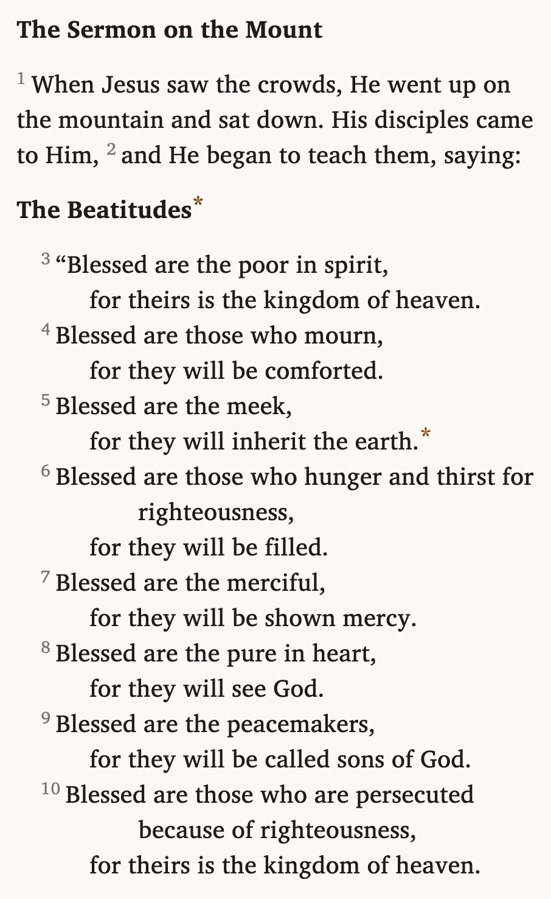

# Scripture

<div align="center">
  
  <br />
  <b>Complex USFM layout with poetry and footnotes</b>
</div>

A Flutter package designed for rendering interactive, selectable, and structured text. While optimized for [USFM](https://ubsicap.github.io/usfm/) (Bible) data, its core rendering engine is flexible enough for any application requiring precise, word-level interaction and complex layout management. (RTL layout still needs to be added.)

Unlike standard Flutter text widgets, `scripture` renders text as interactive words, allowing you to bind database IDs to specific words, handle precise multi-word selection, and manage footnotes or verse numbers.

> **Warning**: This package is still in early development and breaking changes are likely.

## Features

- **USFM Parsing & Rendering:** Built-in support for parsing USFM tokens (Paragraphs, Poetry, Selah/Margins, Footnotes) into Flutter widgets.
- **Word-Level Interaction:** Detect taps and long-presses on specific words.
- **Data-Driven Selection:** Select text based on unique IDs (e.g., `BookChapterVerseWordID`) rather than simple string indices.
- **Customizable Styling:** Full control over fonts, colors, and indentation based on paragraph types (e.g., poetry vs. prose).
- **Footnote Support:** Integrated support for rendering and interacting with footnote markers.
- **Performance:** Uses custom `RenderBox` implementations (`RenderPassage`, `RenderParagraph`, `RenderWord`) to ensure efficient layout even with complex interactability.

## Usage: The Simple Way (USFM)

If you are building a Bible app or working with USFM data, the `UsfmWidget` is your entry point. It handles parsing, layout, and interaction automatically.

### 1. The Widget Implementation

```dart
import 'package:flutter/material.dart';
import 'package:scripture/scripture.dart';

class BiblePage extends StatefulWidget {
  const BiblePage({super.key});

  @override
  State<BiblePage> createState() => _BiblePageState();
}

class _BiblePageState extends State<BiblePage> {
  final selectionController = ScriptureSelectionController();
  List<UsfmLine> lines = [];

  @override
  void initState() {
    super.initState();
    _loadData();
  }

  void _loadData() {
    // In a real app, you would fetch this from a SQLite database.
    // See "Recommended Database Schema" below.
    setState(() {
      lines = [
        UsfmLine(
          bookChapterVerse: 01001001, // Gen 1:1 (packed integer)
          text: "In the beginning God created the heavens and the earth.",
          format: ParagraphFormat.m,
        ),
        // ... more lines
      ];
    });
  }

  @override
  Widget build(BuildContext context) {
    return Scaffold(
      body: UsfmWidget(
        verseLines: lines,
        selectionController: selectionController,
        // Define visual styles for USFM tags
        styleBuilder: (format) {
          return UsfmParagraphStyle.usfmDefaults(
            format: format,
            baseStyle: const TextStyle(fontSize: 18, color: Colors.black),
          );
        },
        // Handle Interactions
        onWordTapped: (wordId) => print("Tapped word ID: $wordId"),
        onFootnoteTapped: (text) => print("Footnote content: $text"),
        onSelectionRequested: (wordId) {
           // Logic to handle selection start (e.g. highlight the whole verse)
        },
      ),
    );
  }
}
```

### 2. Recommended Database Schema

To get the most out of this package, you will probably want to store your scripture data in a SQLite table. The `UsfmWidget` expects data in a specific format, particularly the **Reference ID** (a packed integer) and the **Paragraph Format**.

```sql
CREATE TABLE IF NOT EXISTS bible_verses (
  _id INTEGER PRIMARY KEY AUTOINCREMENT,
  reference INTEGER NOT NULL, -- Packed integer: BBCCCVVV (e.g. 01001001 for Gen 1:1)
  text TEXT NOT NULL,         -- The raw text content (including embedded footnotes)
  format TEXT NOT NULL        -- The USFM tag (e.g., 'p', 'q1', 's1')
);
```

- **reference:** This allows the package to generate unique IDs for every word on the screen (e.g., `1001001005` is the 5th word of Gen 1:1).
- **format:** This string maps directly to the `ParagraphFormat` enum to determine indentation, centering, and poetry styles.

### 3. Supported USFM Tags

The package currently supports the following standard USFM markers:

| Type               | Tags                              | Description                                                         |
| :----------------- | :-------------------------------- | :------------------------------------------------------------------ |
| **Headings**       | `s1`, `s2`, `ms`, `mr`, `qa`, `d` | Section headers, major sections, acrostics, and descriptive titles. |
| **Paragraphs**     | `m`, `pmo`, `b`                   | Standard margins, embedded text, and blank lines.                   |
| **Poetry & Lists** | `q1`, `q2`, `qr`, `li1`, `li2`    | Indented poetry lines, right-aligned poetry, and list items.        |
| **Formatting**     | `pc`, `r`                         | Centered paragraphs and cross-references.                           |

## Usage: The Advanced Way (Custom Layouts)

If you are not using USFM but want the word-level selection features (e.g., for an e-reader or educational app), you can build the component tree manually using `PassageWidget` and `ParagraphWidget`.

### Core Concepts

1.  **PassageWidget:** The root container that calculates intrinsic sizes for scrolling.
2.  **ParagraphWidget:** Handles line breaking, indentation, and alignment.
3.  **TextAtomWidget:** Prevents wrapping content that should stay together (like a Word + Footnote).
4.  **WordWidget:** The leaf node that renders the text and holds the ID.

```dart
PassageWidget(
  children: [
    ParagraphWidget(
      firstLineIndent: 20.0,
      selectionController: myController,
      children: [
        // A simple word
        WordWidget(text: "Hello", id: 1),
        SpaceWidget(width: 5),
        
        // A word with a footnote attached
        TextAtomWidget(
          children: [
            WordWidget(text: "World", id: 2),
            FootnoteWidget(marker: "*", text: "The earth"),
          ]
        ),
      ],
    ),
  ],
)
```

## Architecture

The package is designed with a modular architecture, separating data definitions from rendering logic. This allows you to use the core data models in non-Flutter environments (like CLI tools or server-side scripts).

### 1. Scripture Core (`scripture_core.dart`)

- **Pure Dart:** This library has **no dependency on Flutter**.
- **Use Case:** Ideal for building database creator tools, CLI parsers, or server-side applications.
- **Function:** It contains the fundamental data models and enums (like `ParagraphFormat` and `HighlightRange`). You can use this to parse raw text/USFM files and populate your database without needing to spin up a Flutter environment.

### 2. Layout Engine (`src/flutter`)

- **Flutter Rendering:** A text rendering engine extending `RenderBox`.
- **Data Agnostic:** This layer knows nothing about "Bibles." It only understands words, spaces, and indentations.
- **State Management:** `ScriptureSelectionController` lives here, managing selections by ID and notifying the render tree to repaint when necessary.

### 3. USFM Integration (`src/flutter/usfm`)

- **The Bridge:** Connects the **Scripture Core** data models to the **Layout Engine**.
- **Function:**
    - `UsfmParser`: Converts your data (e.g., `UsfmLine`) into the widget tree.
    - `UsfmWidget`: The high-level widget that developers use.
    - `UsfmParagraphStyle`: Maps the Core `ParagraphFormat` tags (e.g., `q1`, `p`, `d`) to specific visual styles (fonts, indents, alignment) used by the Layout Engine.

## Selection Logic

Unlike standard text selection which relies on character offsets (0 to n), `scripture` relies on word IDs.

- Every `WordWidget` has an `int id`.
- The `ScriptureSelectionController` tracks `startId` and `endId`.
- This allows you to select text across complex widget trees without worrying about the underlying render tree structure.
- The smallest unit of selection is a word. This makes selection easier because you don't have to precisely select down to the letter level when all you want is to select to the end of the word.

## A request to Bible app makers

Are you making an app where the biblical text is under copyright? Suggest to the copyright owner that they release it to the public domain. Read [*The Bondage of the Word: Copyright and the Bible*](https://sellingjesus.org/articles/copyright-and-the-bible#other-modern-translations) for some good reasons why.

Paywalls and ads hinder people from reading God's word. Consider [other funding options](https://copy.church/explain/funding/) instead.

## TODOs

- Add support for RTL text.
- Handle Bidi text.
- Add support for vertical text (traditional Mongolian, maybe traditional CJK).

## Open source apps that use this package

- [Berean Standard Bible (BSB) app](https://github.com/ethnosdev/bsb)

## License

The code in this package is dedicated to the public domain (CC0).
